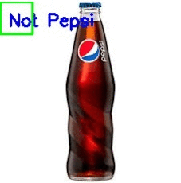
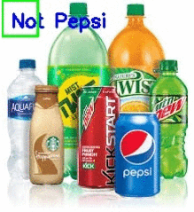

# Logo-Classifier

This code Pepse company logos in a given image.

# Dataset

It is trained on [Flickr Logos 27 dataset](http://image.ntua.gr/iva/datasets/flickr_logos/)

# Prerequisites

>The code is developed for python 2.7 using a jupyter notebook

>All dependencies are mentioned in Requirements.txt 

# Demo

A gif showing single Pepsi bottle

A gif showing multiple brand bottles

# Algorithms

I've used **Convolution Neural Network** for the classification. 

The model detects Pepsi logo with an accuracy of **~99%**.

It uses Sliding window algorithm(as show above) to detect logo in different parts of the image

# Prediction

To run the prediction on a new image just run the following command

>python evaluate.py --image image_path
